<h1 align="center">
Online-video-sharing-platform

The system includes **a user-oriented video playback module** and **a background information management module**.

Video playback module mainly contains video search, play, upload and share, user information management, video management, video collection, viewing history and other functions.

Background information management module mainly contains user information management, video management, video audit, advertising management, video category management and other functions.

# Technology

## Project Development Environment and Technology

* **Languages**: Java, JavaScript, Html
* **Development Tools**: IDEA 2019, Navicat
* **Database**: MySQL 5.7
* **Server**: Tomcat 8.0
* **Front-end part using technology**: HTML tags and CSS styles for the overall design of the interface, with Bootstrap framework and LayUI framework to complete a simple and practical interface, and the use of JavaScript language, ajax technology and JQuery framework to achieve the interactive effects of the front-end page and the interaction with the back-end data.
* **Technology used in the back-end part**: use Thymeleaf template engine for page rendering, use mainstream SSM (Spring + SpringMVC + MyBatis) framework for the overall system architecture, and use MyBatisPlus to simplify the persistence layer development and SpringBoot to simplify the configuration.

## Front-end and back-end development structure

This project uses **SpringBoot** framework plus **Thymeleaf** template engine development structure for back-end and front-end development and interaction.

SpringBoot framework application based on Spring , is committed to simplify the Spring development project . Its most prominent feature and the purpose of my use of this framework is the agreement is greater than the configuration and out-of-the-box configuration strategy by SpringBoot's own default configuration to configure the target structure , greatly simplifying the configuration of all aspects of the Spring application .

At the same time SpringBoot embedded Tomcat server , and integrated a large number of components , so that it can provide strong support for project development in all directions such as testing , deployment , monitoring , interaction .

# Function

- **Client Functionality Hierarchy Diagram**

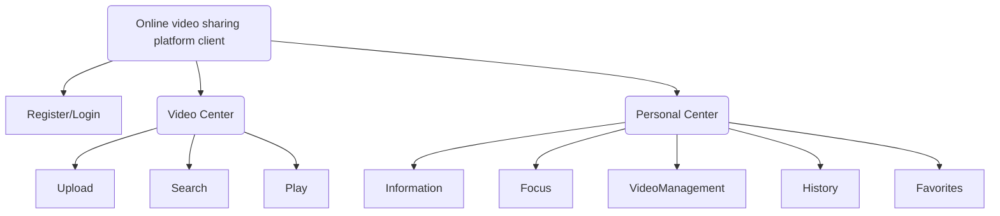

- **Client Function Description**

| No.    | Function           | Description                                                  |
| ------ | ------------------ | ------------------------------------------------------------ |
| **1**  | `Register/Login`   | Users enter the account password to log in the platform, first time users need to fill in the mailbox, set the account password to register and login. |
| **2**  | `Information`      | Users can view and modify personal information on the personal information screen. |
| **3**  | `Focus`            | This module to view individual followers, you can click on the followers to enter the user home page. |
| **4**  | `Video Management` | This module displays the videos shared and uploaded by users, including uploaded, pending review, and unapproved videos, and users can modify, downgrade, and delete the videos. |
| **5**  | `History`          | This module displays the user's video viewing history, which can be accessed by clicking on the history to enter the video playback interface. |
| **6**  | `Favorites`        | This module shows the user's video collection, you can click on the collection to enter the video playback interface. |
| **7**  | `Upload`           | Users can share videos in this module, they need to fill in the video title, description, video category and other information, and upload the video cover and video source |
| **8**  | `Search`           | Users can search for videos in this module to quickly locate the desired video. |
| **9**  | `Play`             | Users can watch videos in the video playback interface       |
| **10** | `Comment`          | Users can comment or reply on the video playback screen      |

- **Functional hierarchy diagram of backend administration side**

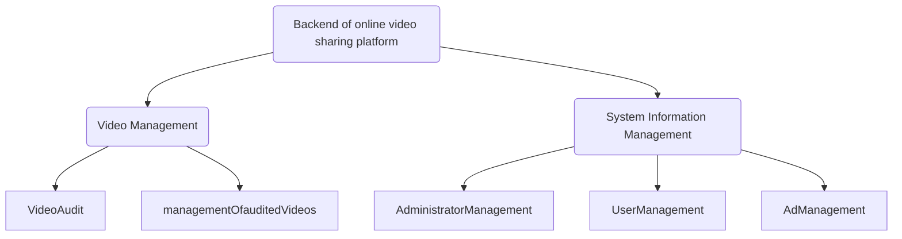

- **Functional description of backend administration side**

| No.   | Function                       | Description                                                  |
| ----- | ------------------------------ | ------------------------------------------------------------ |
| **1** | `Video Audit`                  | This module displays the list of videos to be audited, and the auditor performs manual auditing of individual videos under this module. |
| **2** | `Management of audited videos` | This module shows all the reviewed videos, you can downgrade the videos, you can view the video details. |
| **3** | `Comments Management`          | The module displays all video comments, can query the specified video comments, and can delete the comments. |
| **4** | `Administrator Management`     | This module displays all administrator information and allows you to add, edit and block administrators. |
| **5** | `User Management`              | This module displays all video user information, can modify some of the user information and the user ban recovery process. |
| **6** | `Video Category Management`    | This module displays all video classification information, you can add and edit video classification, support secondary classification. |
| **7** | `Ad Management`                | This module displays all ad information and allows you to add, edit and delete ad information. |

# Database connection

Traditional Java programs connect to the database through native JDBC, but this method has some drawbacks, whenever we need to operate the database, we have to connect first, then operate the Connection object, Statement object and ResultSet object to get the data and map it to the entity class or corresponding data structure, and after the operation, we have to do the exact closure. This series of operations undoubtedly increases the workload and complexity, and we need to catch the exceptions that may be encountered during the operation.

Therefore, we need to use the ORM model to operate on the database, **ORM mapping relationship model**, through the encapsulation of JDBC, to solve the mutual mapping of database and POJO objects.

In this project, the backend of the online video sharing platform uses the **MyBatis persistence layer framework**, MyBatis as a semi-automatic mapping framework can provide simple automatic mapping and flexible configuration through the configuration file when using complex sql statements or logic, greatly improving the development efficiency and flexibility, and the project also uses **MyBatisPlus* * to simplify some of the simple sql query statements.

At the same time, in order to simplify the database connection steps, improve the response time of front-end requests and server performance, and reuse the database connection, **Druid connection pool ** was selected to manage the database connection.

- **Configuration Codes**

  ```yml
  server:
    port: 8080
    servlet:
      context-path: /video
  spring:
    datasource:
      name: test
      url: jdbc:mysql://127.0.0.1:3306/video?useSSL=false&serverTimezone=UTC&autoReconnect=true&failOverReadOnly=false
      username: ******
      password: ******
      type: com.alibaba.druid.pool.DruidDataSource
      driver-class-name: com.mysql.jdbc.Driver
      filters: stat
      maxActive: 20
      initialSize: 1
      maxWait: 60000
      minIdle: 1
      timeBetweenEvictionRunsMillis: 60000
      minEvictableIdleTimeMillis: 300000
      validationQuery: select 'x'
      testWhileIdle: true
      testOnBorrow: false
      testOnReturn: false
      poolPreparedStatements: true
      maxOpenPreparedStatements: 20
  
  mybatis-plus:
    type-aliases-package: com.wk.video.bean
    mapper-locations: classpath:mapping/*.xml
    configuration:
      log-impl: org.apache.ibatis.logging.stdout.StdOutImpl
  ```

  

**Chinese language：**
<h1 align="center">
  <div align="center">在线视频分享平台</div>
</h1>
<div align="center">本系统包括面向用户的<b>视频播放模块</b>与<b>后台信息管理模块</b></div>
<div align="center">视频播放模块主要包含视频搜索、播放、上传分享，用户信息管理、视频管理、视频收藏、观看历史等功能</div>
<div align="center">后台信息管理模块主要包含用户信息管理，视频管理，视频审核，广告管理，视频分类管理等功能</div>

---
### 相关技术
#### 项目开发环境及技术
* **语言**：Java，JavaScript，Html
* **开发工具**：IDEA 2019，Navicat
* **数据库**：MySQL 5.7
* **服务器**：Tomcat 8.0
* **前端部分使用技术**：HTML标签和CSS样式对界面进行总体设计，配合Bootstrap框架和LayUI框架完成简约且实用的界面，并使用JavaScript语言、ajax技术和JQuery框架来实现前端页面的交互效果以及与后台进行数据的交互。
* **后端部分使用技术**：使用Thymeleaf模板引擎进行页面渲染，使用主流SSM（Spring+SpringMVC+MyBatis）框架进行整体系统的架构，并使用MyBatisPlus简化持久层开发和SpringBoot简化配置。
#### 前后端开发结构
>本项目采用**SpringBoot**框架加**Thymeleaf**模板引擎的开发结构进行后端与前端的开发与交互。
>
>SpringBoot框架应用以Spring为基础，致力于简化Spring开发项目。它最突出的特点同时也是本人使用此框架的目的，就是约定大于配置和开箱即用的配置策略，由SpringBoot自身的默认配置来配置目标结构，大大简化了Spring应用的各方面配置。
>
>同时SpringBoot内嵌Tomcat服务器，并集成了大量组件，使其对项目开发的测试、部署、监控、交互等各个方向都能提供有力支持。

### 功能设计

* **客户端功能层级图**

```mermaid
graph TD
A(在线视频分享平台客户端) --> 用户注册登录
A --> C(视频中心)
A --> B(个人中心)
B --> 个人信息
B --> 用户关注
B --> 上传视频管理
B --> 观看历史
B --> 视频收藏
C --> 视频上传
C --> 视频搜索
C --> 视频观看
````

* **客户端功能描述**

|编号                     |名称                           |描述                         |
|------------------------|-------------------------------|-----------------------------|
|**1**  |`用户注册登录`            |用户输入账号密码登录平台，初次使用需填写邮箱，设置账号密码进行注册后登录            |
|**2**|`个人信息`            |用户可在个人信息界面查看并修改个人信息            |
|**3**|`用户关注`            |此模块查看个人关注用户，可点击关注用户进入用户主页            |
|**4**|`上传视频管理`            |此模块显示用户分享上传的视频，包括已上传、待审核、审核不通过视频，用户可对视频进行修改、下架、删除等操作            |
|**5**|`观看历史`            |此模块显示用户的视频观看历史，可通过点击历史记录进入视频播放界面            |
|**6**|`视频收藏`            |此模块显示用户的视频收藏，可通过点击收藏进入视频播放界面            |
|**7**|`视频上传`            |用户可在此模块分享视频，需要填写视频标题、描述、视频分类等信息，并上传视频的封面和视频源            |
|**8**|`视频搜索`            |用户可在此模块进行视频搜索，快速定位需要的视频            |
|**9**|`视频观看`            |用户可在视频播放界面进行视频观看          |
|**10**|`视频评论`            |用户可在视频播放界面进行评论或回复            |

* **后台管理端功能层级图**

```mermaid
graph TD
A(在线视频分享平台后台) --> C(视频管理)
A --> B(系统信息管理)
B --> 管理员管理
B --> 用户管理
B --> 广告管理
C --> 视频审核
C --> 已审核视频管理
````

* **后台管理端功能描述**

|编号                     |名称                           |描述                         |
|------------------------|-------------------------------|-----------------------------|
|**1**|`视频审核`            |该模块显示待审核视频列表，审核人员在该模块下对单个视频进行人工审核            |
|**2**|`已审核视频管理`       |该模块显示所有已审核视频，可以对视频进行下架处理，可查看视频详情            |
|**3**|`评论管理`            |该模块显示所有视频评论，可查询指定视频评论，可以对评论进行删除处理     |
|**4**|`管理员管理`            |该模块显示所有管理员信息，可以添加、编辑和封禁管理员 |
|**5**|`用户管理`            |该模块显示所有视频用户信息，可以修改用户部分信息和对用户进行封禁恢复处理          |
|**6**|`视频分类管理`            |该模块显示所有视频分类信息，可以添加、编辑视频分类，支持二级分类        |
|**7**|`广告管理`            |该模块显示所有广告信息，可以添加、编辑和删除广告信息           |

### 数据库连接
>传统Java程序通过原生JDBC连接数据库，但此方法存在一些弊端，每当我们需要操作数据库时，都要先进行连接，然后操作Connection对象、Statement对象和ResultSet等对象去获取数据并映射到实体类
>或对应数据结构上，在操作完后还要进行准确的关闭，并且要对操作过程中可能遇到的异常进行捕获处理，这一系列操作无疑增大了工作量和复杂度。
>
>因此，我们需要用到ORM模型对数据库进行操作，**ORM映射关系模型**，通过对JDBC的封装，解决数据库与POJO对象的相互映射。
>
>在本项目线视频分享平台的后台使用的就是**MyBatis持久层框架**，MyBatis作为半自动映射框架能够提供简单的自动映射，并在用到复杂sql语句或逻辑时也可通过配置文件进行灵活配置，大大提高了开
>发效率和灵活性，并且项目还使用到**MyBatisPlus**来简化部分简单的sql查询语句。
>
>同时为了能简化数据库的连接步骤，提高前端请求的响应时间和服务器的性能，重复利用数据库的连接，选择了**Druid连接池**，用来管理数据库的连接。
* **配置代码如下：**

```yml
server:
  port: 8080
  servlet:
    context-path: /video
spring:
  datasource:
    name: test
    url: jdbc:mysql://127.0.0.1:3306/video?useSSL=false&serverTimezone=UTC&autoReconnect=true&failOverReadOnly=false
    username: ******
    password: ******
    type: com.alibaba.druid.pool.DruidDataSource
    driver-class-name: com.mysql.jdbc.Driver
    filters: stat
    maxActive: 20
    initialSize: 1
    maxWait: 60000
    minIdle: 1
    timeBetweenEvictionRunsMillis: 60000
    minEvictableIdleTimeMillis: 300000
    validationQuery: select 'x'
    testWhileIdle: true
    testOnBorrow: false
    testOnReturn: false
    poolPreparedStatements: true
    maxOpenPreparedStatements: 20

mybatis-plus:
  type-aliases-package: com.wk.video.bean
  mapper-locations: classpath:mapping/*.xml
  configuration:
    log-impl: org.apache.ibatis.logging.stdout.StdOutImpl
```
### 部分界面展示

#### 客户端

* **客户端登录**
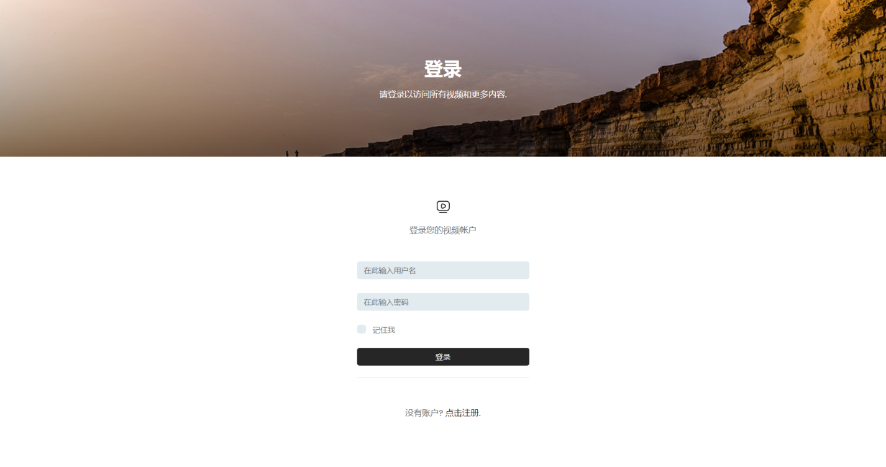
---
* **客户端注册**
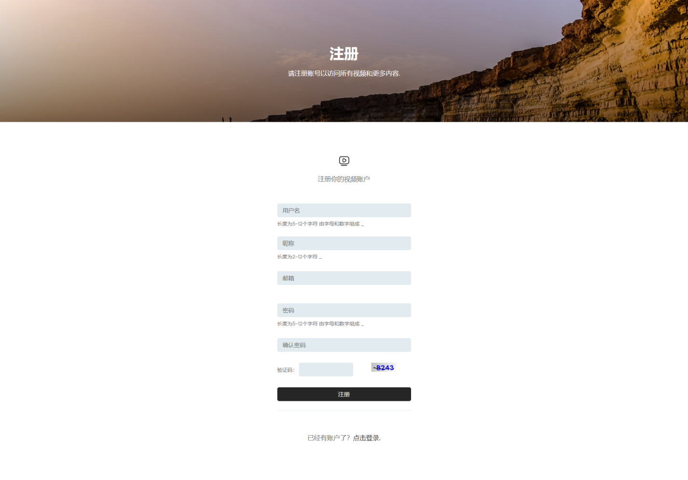
---
* **首页**
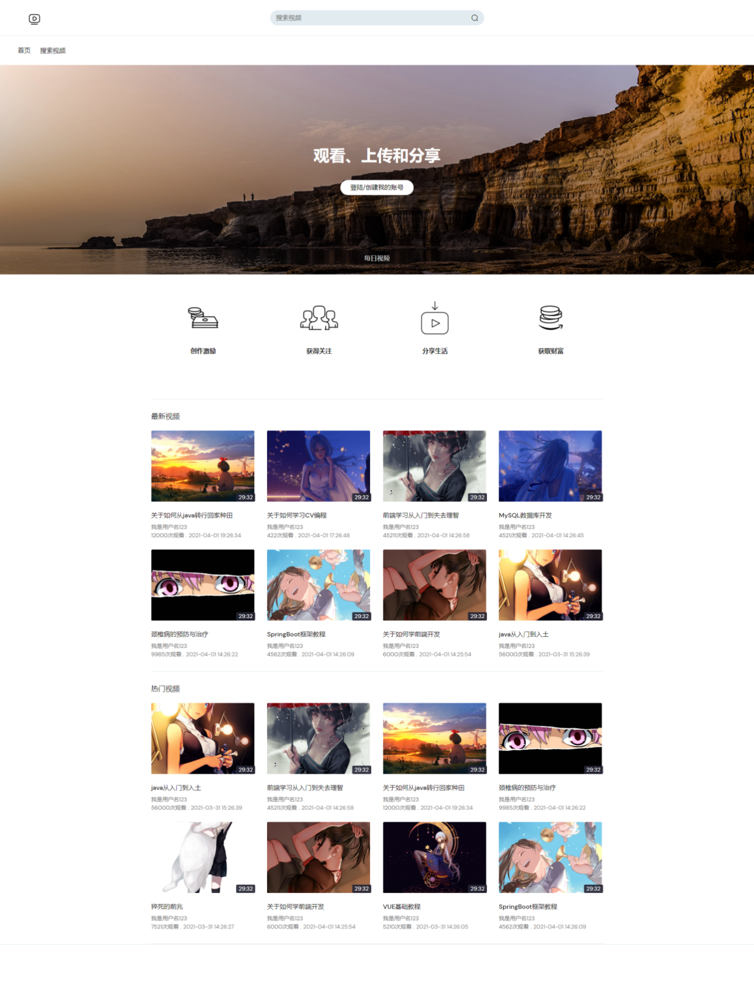
---
* **个人信息**
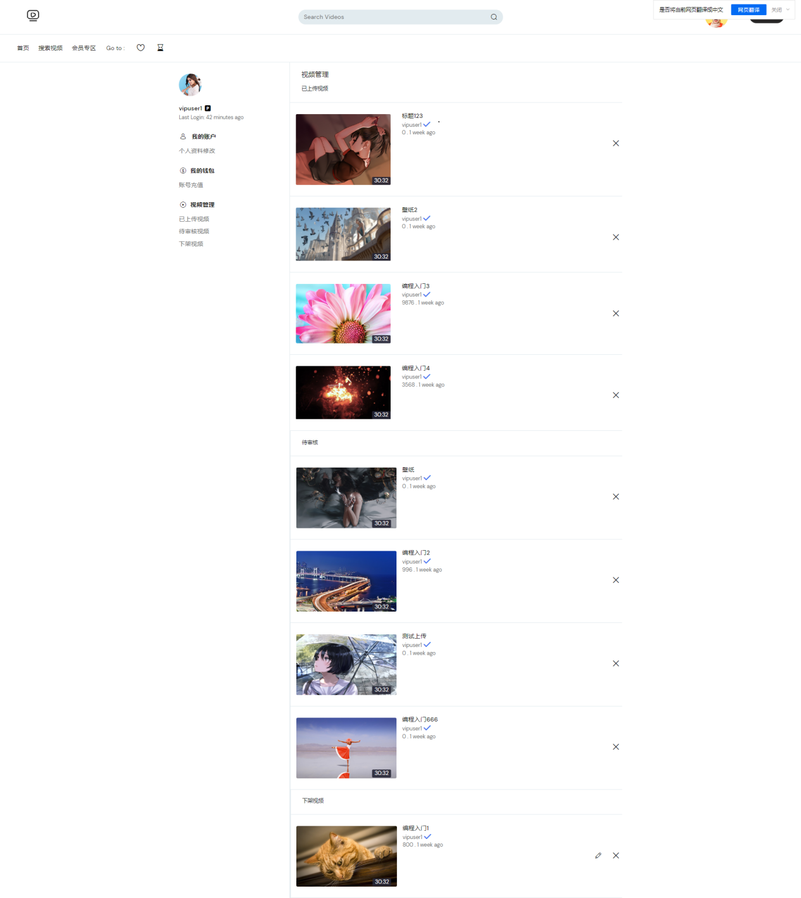
---
* **视频搜索**
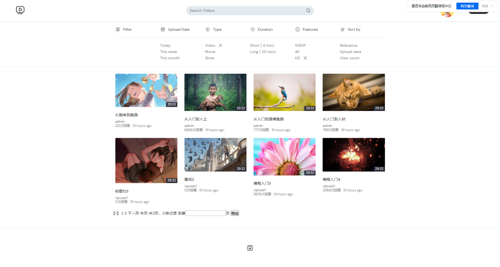
---
* **视频播放**
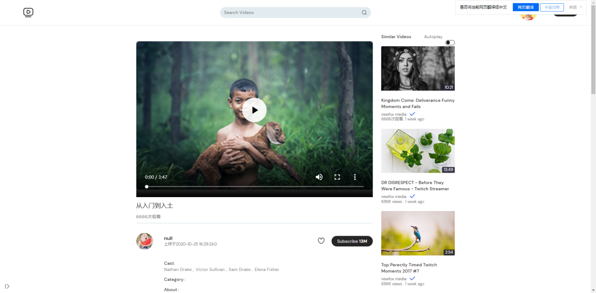
---
* **视频上传**
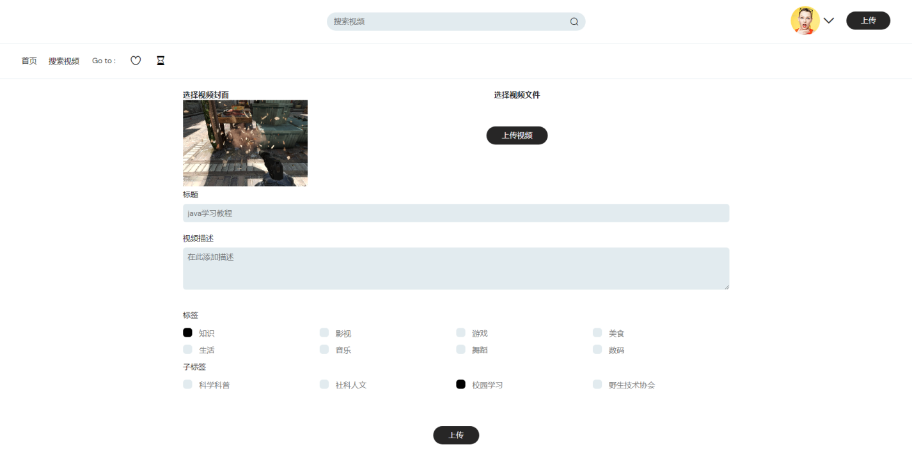
---

#### 后台

* **视频审核列表**
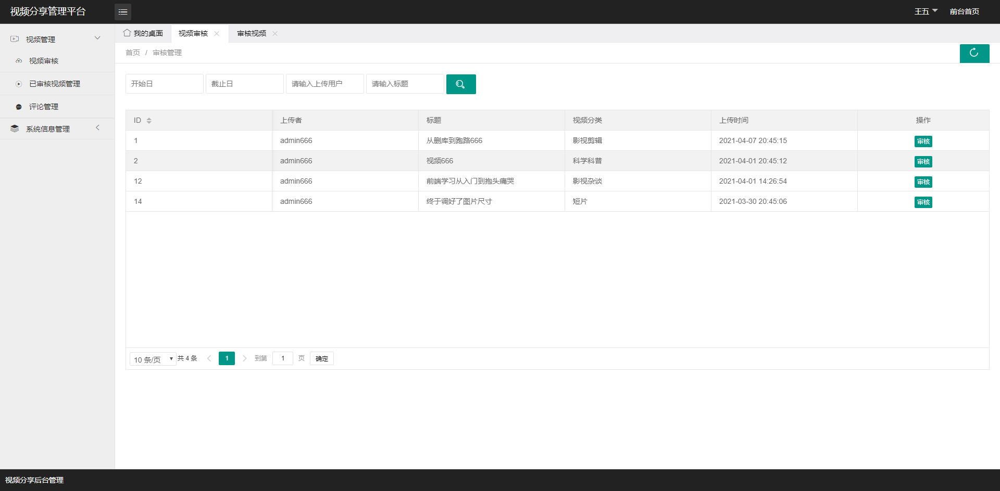
---
* **视频审核**
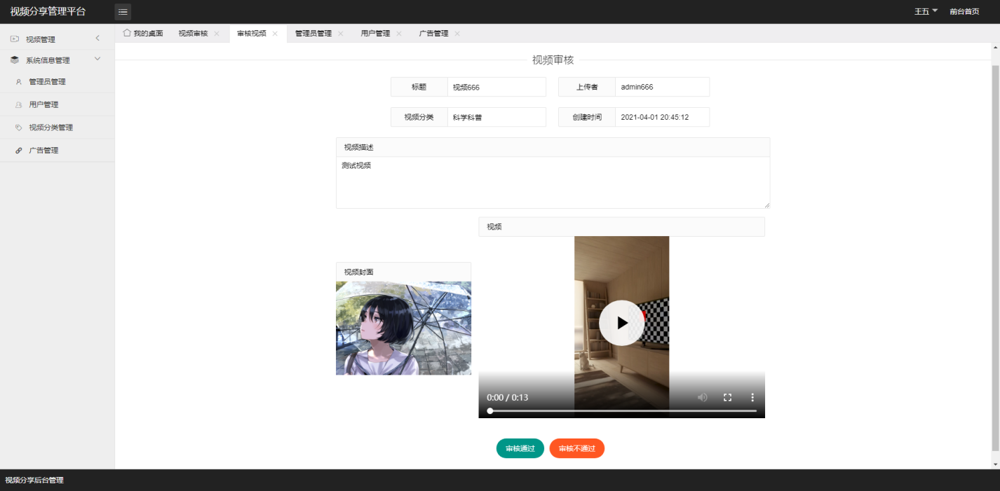
---
* **管理员管理**
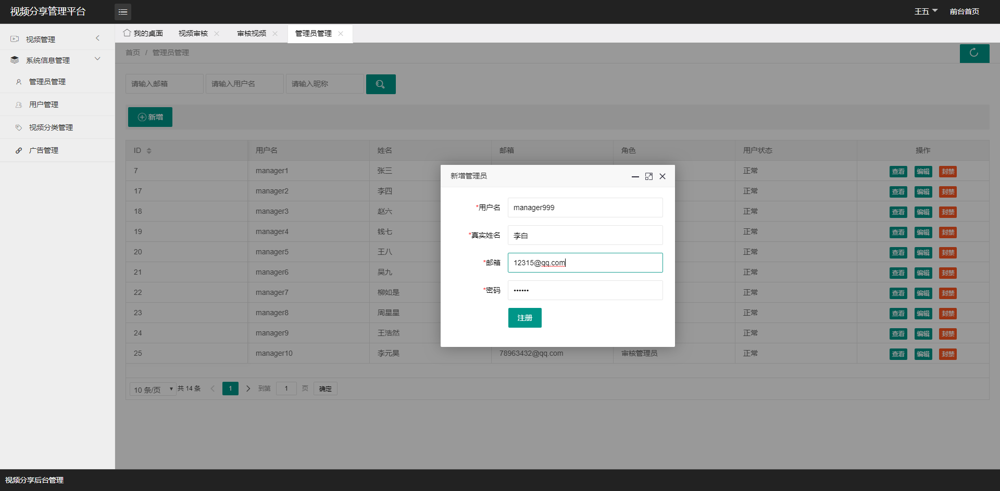
---
* **广告管理**
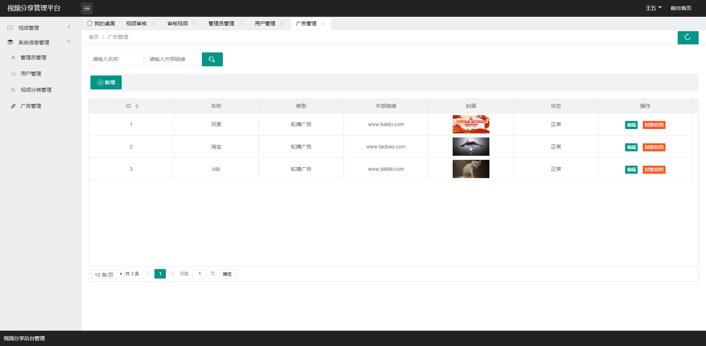
---

### 声明
* **该程序仅供学习交流。**
